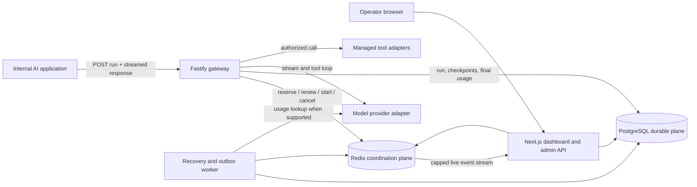

# AgentMeter architecture blueprint

- Status: Proposed implementation blueprint
- Last updated: 2026-09-21
- Scope: Architecture and delivery contract; no production code exists yet

## 1. Product boundary

AgentMeter is a multi-tenant control plane for autonomous AI runs. An application cannot start governed provider work until AgentMeter has authenticated it, evaluated its policy, calculated a conservative maximum cost, and atomically reserved budget and concurrency capacity.

AgentMeter governs work that actually passes through its gateway. It does not claim to control provider calls or tool executions made out of band.

The first complete release must provide:

- Atomic budget and parallel-run admission
- Model, tool, token, cost, and duration policies
- Idempotent run creation and settlement
- Streaming model output through a provider-neutral interface
- Managed tool-call interception and auditing
- Disconnect, retry, crash, and lease-expiration recovery
- A PostgreSQL usage ledger and reconciliation workflow
- A live operational dashboard
- Repeatable concurrency, fault, and load evidence

The first release is intentionally not:

- A general-purpose agent framework or prompt builder
- A model router that optimizes response quality
- A payment processor or customer invoicing system
- A guarantee over tool calls that bypass the gateway
- A multi-region active-active system
- A store for prompt/output content by default

## 2. Architectural principles

1. **Admit conservatively.** Uncertainty can reduce temporary availability; it must not silently increase spend authority.
2. **Keep the ledger truthful.** Provider overages and incomplete usage are explicit states, not values rounded into a convenient answer.
3. **Make every side effect retryable.** Reservations, start claims, cancellations, settlements, outbox deliveries, and reconciliation actions are idempotent.
4. **Separate durable truth from hot coordination.** PostgreSQL owns the audit record. Redis owns fast atomic projections that can be rebuilt.
5. **Never start a provider from Redis approval alone.** The run must exist durably and win a single execution claim first.
6. **Treat disconnects as expected.** Client connection state, provider execution state, and billing state are separate concerns.
7. **Measure before claiming.** Resume and performance numbers remain placeholders until the benchmark suite produces artifacts.
8. **Start as a modular monorepo.** Use a few independent deployables with shared contracts, not a fleet of premature microservices.

## 3. System context



### Trust boundaries

- The tenant identity is derived from the API key or dashboard session. A request body cannot select an arbitrary tenant.
- Maximum reservable cost is calculated by AgentMeter from validated input, policy, and a versioned price record. The client cannot declare its own price.
- Provider credentials never reach the browser and are never written to logs or event payloads.
- Tool enforcement applies only to tool schemas and executions mediated by AgentMeter.
- PostgreSQL and Redis are private infrastructure; only the gateway, worker, and dashboard server may connect to them.

## 4. Deployable units

| Unit | Responsibility | Scaling model |
| --- | --- | --- |
| Fastify gateway | Runtime authentication, policy admission, Redis reservation, provider streaming, tool interception, usage checkpoints | Stateless replicas; active stream lives on one replica |
| Worker | Outbox settlement, lease sweeping, reconciliation, rollups, drift audits | Multiple replicas using database claims/locks |
| Next.js dashboard | Operator UI, administrative API, reporting queries, live SSE fan-out | Stateless replicas |
| Provider simulator | Deterministic streaming, usage, delay, disconnect, and error scenarios for local/fault testing | Local and CI only |
| PostgreSQL | Durable relational state, append-only usage data, settlement, outbox | Single primary in v1 |
| Redis | Atomic admission and live coordination projection | Single instance locally; replicated/cluster-ready key design |

The gateway and worker can share one container image with different entry points, but remain separately scalable processes.

## 5. Proposed monorepo layout

```text
agentmeter/
├── apps/
│   ├── dashboard/              # Next.js operator UI and admin route handlers
│   ├── gateway/                # Fastify runtime data plane
│   ├── worker/                 # outbox, leases, reconciliation, rollups
│   └── provider-simulator/     # deterministic streaming/failure target
├── packages/
│   ├── contracts/              # schemas, event envelopes, public types
│   ├── config/                 # validated environment configuration
│   ├── database/               # Prisma schema/client and SQL migrations
│   ├── policy/                 # pure policy evaluation and cost bounds
│   ├── redis-control/          # typed FCALL wrappers and key builders
│   ├── providers/              # provider interface and adapters
│   └── observability/          # logging, metrics, tracing conventions
├── redis/
│   └── functions/              # versioned Lua function libraries
├── tests/
│   ├── integration/
│   ├── invariants/
│   ├── fault/
│   └── k6/
├── infra/
│   └── docker/                 # images, health checks, init assets
├── docs/
│   ├── decisions/
│   ├── architecture.md
│   ├── operations.md           # added during recovery phase
│   └── benchmark-results.md    # measured results only
└── ROADMAP.md
```

Package boundaries are logical, not network boundaries. Shared packages must avoid importing application entry points.

## 6. Admission and run lifecycle

### 6.1 Public request

`POST /v1/runs` requires an `Idempotency-Key` header and accepts a validated request containing:

- Application identifier
- Agent identifier/version
- Requested model
- Input/messages
- Maximum output tokens
- Requested tool definitions or registered tool identifiers
- Maximum duration
- Optional non-sensitive metadata

The gateway authenticates first, derives the tenant and application scope, and refuses unknown model/tool identifiers before contacting Redis.

### 6.2 Admission sequence

```mermaid
sequenceDiagram
  participant C as Client
  participant G as Gateway
  participant R as Redis Function
  participant P as PostgreSQL
  participant M as Model provider
  participant W as Worker

  C->>G: POST /v1/runs + Idempotency-Key
  G->>G: authenticate, evaluate policy, compute cost bound
  G->>R: reserve_run(tenant keys, run ID, bound, lease)
  alt denied
    R-->>G: stable rejection reason
    G-->>C: 4xx/429 admission response
  else duplicate
    R-->>G: existing run ID and status
    G-->>C: existing run reference; no new provider call
  else approved
    R-->>G: new reservation
    G->>P: insert RESERVED run and policy/price snapshots
    alt insert fails
      G->>R: cancel_reservation(run ID)
      G-->>C: unavailable
    else insert succeeds
      G->>P: conditional execution claim
      G->>R: mark_running(run ID)
      G->>M: start provider stream
      M-->>G: deltas, tool calls, usage, completion
      G-->>C: framed stream events
      G->>P: transaction: final usage + settlement + outbox
      W->>P: claim settlement outbox event
      W->>R: settle_run(settlement ID, reserved, actual)
      R-->>W: applied or already applied
      W->>P: mark outbox delivered
    end
  end
```

There is deliberately no network call inside the final PostgreSQL transaction.

### 6.3 State machine

`CREATED` is an in-process admission state. Approved durable runs begin at `RESERVED`; denied attempts are retained as admission events for operational analytics.

```mermaid
stateDiagram-v2
  [*] --> CREATED
  CREATED --> REJECTED: policy, budget, or concurrency denial
  CREATED --> RESERVED: Redis reservation + durable insert
  RESERVED --> RUNNING: single durable execution claim
  RESERVED --> CANCELLED: provider never started
  RESERVED --> EXPIRED: lease abandoned
  RUNNING --> SETTLEMENT_PENDING: final usage known
  RUNNING --> ABORTED: client/provider abort; usage incomplete
  RUNNING --> FAILED: provider or gateway failure
  ABORTED --> RECONCILING
  FAILED --> SETTLEMENT_PENDING: final usage known
  FAILED --> RECONCILING: usage uncertain
  EXPIRED --> CANCELLED: durable record proves provider never started
  EXPIRED --> RECONCILING: provider may have started
  RECONCILING --> SETTLEMENT_PENDING: usage resolved or policy timeout reached
  SETTLEMENT_PENDING --> SETTLED: PostgreSQL committed; Redis delivery pending or applied
  SETTLED --> [*]
  CANCELLED --> [*]
  REJECTED --> [*]
```



`SETTLED` means the durable ledger is final for the current evidence. The associated outbox event may still be retrying; this can reduce Redis availability but cannot grant extra budget.

## 7. Financial model and invariants

### 7.1 Units

- All money is stored as signed 64-bit integer microdollars.
- v1 supports USD budgets only; the currency field is still explicit.
- Token counts, tool counts, durations, and concurrency counts are integers.
- Redis Function inputs are range-checked to remain exactly representable by the Lua runtime as well as valid for Redis integer commands.
- Timestamps are UTC; durations use integer milliseconds.
- A run is charged to the immutable budget period in which its reservation was admitted, even if the stream crosses a period boundary.

### 7.2 Reservation bound

The policy package computes the maximum charge from:

- Counted/estimated input units
- Maximum output tokens allowed after policy reduction
- Versioned provider/model price dimensions
- Maximum permitted tool invocations and known tool charges
- A documented safety margin for dimensions that cannot be exact

The exact price/policy snapshots and bound calculation version are stored on the run. If a safe upper bound cannot be computed, admission fails closed.

### 7.3 Required invariants

For one tenant budget period:

```text
available = limit - settled_spend - active_reservations
available >= 0
settled_spend + active_reservations <= limit
active_runs <= configured_parallel_run_limit
```

Across both stores:

- At most one reservation exists for a tenant/idempotency digest.
- At most one gateway wins the provider execution claim for a run.
- At most one base settlement exists per run.
- Replaying a settlement cannot change balances twice.
- A run that may have contacted a provider is not released as zero-cost solely because its Redis lease expired.
- After reconciliation, the PostgreSQL ledger and rebuilt Redis projection have zero unexplained drift.

If provider-reported actual cost exceeds the reservation, the ledger records the full actual cost, an overage incident is opened, and new admissions for that budget can be frozen. AgentMeter does not falsify actual spend to preserve the normal-case inequality.

## 8. Redis coordination plane

### 8.1 Cluster-compatible keys

All keys touched by one function use a tenant hash tag:

```text
am:{tenant-123}:budget:<period-id>
am:{tenant-123}:run:<run-id>
am:{tenant-123}:idem:<sha256-digest>
am:{tenant-123}:leases
am:{tenant-123}:live
```

The raw API key and idempotency key are never used directly in a Redis key.

There is no cross-tenant atomic function. Workers discover tenants/budget periods from PostgreSQL and process each tenant slot independently.

### 8.2 Function library

The versioned library exposes small, bounded functions:

| Function | Atomic responsibility |
| --- | --- |
| `reserve_run` | Return an existing idempotent result or check budget/concurrency, reserve funds, create run state, and index its lease |
| `mark_running` | Move one reserved run to running without changing the reservation |
| `renew_lease` | Extend an owned active lease with a monotonic fencing token |
| `cancel_reservation` | Release a never-started reservation once, remove its lease, decrement active count |
| `settle_run` | Apply one settlement ID once, release the full reservation, add actual spend, decrement active count |
| `hold_for_reconciliation` | Mark uncertain capacity as held so expiration cannot release it |
| `restore_projection` | Rehydrate a known durable run during controlled rebuild |

Function execution remains short: no scans, unbounded loops, or large event payloads. Function loading is a deployment operation, and readiness verifies the expected library/version on every Redis primary.

### 8.3 Lease design

Each active run hash stores an absolute expiration and fencing token. A per-tenant sorted set indexes expiration times. Key TTLs are cleanup aids, not the recovery scheduler.

The gateway renews a lease while the provider execution is active. The sweeper reads due IDs, checks durable run evidence, and then chooses one idempotent action:

- Missing durable run: release the orphaned reservation.
- Durable run with no execution claim: cancel and release.
- Provider may have started: keep funds held and open/continue reconciliation.
- Durable final settlement exists: replay the settlement outbox path.

This distinction prevents a dead gateway from turning uncertain provider spend into newly available money.

### 8.4 Idempotency behavior

The Redis mapping returns `{runId, decision, status, created}`. Only `created=true` may continue toward run insertion. PostgreSQL also enforces unique `(tenant_id, idempotency_digest)` as a durable backstop.

If Redis returns an existing run, the gateway never starts a second provider request. It returns the existing run identifier/status and a URL for status/events. The first version does not promise byte-for-byte replay of an already-consumed model stream.

### 8.5 Redis state loss

On an empty or inconsistent Redis instance:

1. Gateway readiness closes admission; existing streams may finish and write PostgreSQL.
2. Deployment loads and verifies the Function library.
3. A rebuilder acquires a durable singleton lock and increments a projection generation.
4. It calculates settled spend and non-terminal reservations from PostgreSQL.
5. It restores budget, run, idempotency, and lease projections per tenant.
6. It checks totals against independent SQL audit queries.
7. Admission reopens only when the generation and checks pass.

Live dashboard events may be lost during Redis loss; the dashboard resets from PostgreSQL and resumes from the new live stream.

## 9. PostgreSQL durable plane

### 9.1 Core model

| Table | Purpose and important constraints |
| --- | --- |
| `tenant` | Tenant identity and status |
| `user` / `tenant_membership` | Operators and tenant roles |
| `application` | Governed client/application scope |
| `api_key` | Prefix, one-way secret digest, scope, rotation/revocation metadata |
| `budget` / `budget_period` | Limit, currency, period, scope, status; no floating-point money |
| `policy` / `policy_version` / `policy_binding` | Immutable versioned rules and assignment precedence |
| `model_price` | Effective-dated provider/model price dimensions |
| `agent_run` | State, idempotency digest, reservation, actual cost, execution claim, policy/price snapshots, timing |
| `usage_event` | Append-only normalized provider/tool usage and reconciliation evidence |
| `tool_invocation` | Requested tool, policy decision, duration, result class, charge; no secret payload by default |
| `settlement` | Unique base settlement per run with totals and evidence quality |
| `settlement_adjustment` | Optional append-only correction when authoritative evidence arrives after a base settlement; each external evidence ID is unique |
| `outbox_event` | At-least-once cross-store work with attempt/backoff metadata |
| `reconciliation_case` | Reason, evidence, status, attempts, deadline, resolution |
| `admission_event` | Accepted/rejected decisions and stable rejection reason for analytics |
| `daily_usage_rollup` | Dashboard aggregates by tenant/application/model/tool/date |

Every tenant-owned table carries `tenant_id`. Composite foreign keys include tenant scope where practical so a child cannot reference another tenant's parent.

### 9.2 Database constraints

- Unique `(tenant_id, idempotency_digest)` on `agent_run`
- Unique `run_id` on the base `settlement`
- Unique provider evidence/deduplication key on every settlement adjustment
- Unique `(aggregate_type, aggregate_id, event_type, dedupe_key)` for outbox deduplication
- Non-negative checks for token/count/duration and normal monetary fields
- Valid state-transition checks in domain code, with database constraints for terminal invariants
- Append-only protection for `usage_event` and settlement evidence through targeted SQL migration/privileges
- Indexes beginning with `tenant_id` for tenant-scoped access paths
- Partial indexes for open runs, pending outbox events, and open reconciliation cases

Partitioning is deferred until measured table size/query evidence justifies it. The schema keeps time columns and keys suitable for later time partitioning.

### 9.3 Finalization transaction

One short PostgreSQL transaction:

1. Locks or conditionally updates the non-terminal run.
2. Inserts final normalized usage evidence.
3. Inserts the unique settlement.
4. Sets actual cost and moves the run to `SETTLED`.
5. Creates the deduplicated Redis-settlement outbox event.

The transaction performs no provider or Redis network request. A duplicate transaction observes the existing settlement and returns its result.

### 9.4 Outbox delivery

Workers claim due rows in small batches using row locking such as `FOR UPDATE SKIP LOCKED`, commit the claim, perform the Redis call, and record success/failure with bounded exponential backoff.

If a worker dies after Redis applies the settlement but before PostgreSQL records delivery, the next attempt receives `already_applied` from Redis and safely completes the outbox row.

Dead-letter status is visible in the dashboard and never silently discarded.

## 10. Policy and tool enforcement

### 10.1 Resolution

Policy resolution uses explicit precedence with deny-overrides semantics:

1. Tenant defaults
2. Application policy
3. API-key/agent binding

Allow lists intersect; numeric ceilings take the most restrictive value. The resolved immutable snapshot is stored on the run.

### 10.2 Admission checks

- Tenant/application/key enabled
- Model allowed
- Requested tools allowed
- Input and maximum output within limits
- Maximum duration within limit
- Conservative cost bound within per-run limit
- Redis atomic budget and active-run limits

### 10.3 Runtime checks

- Deadline and cancellation signal
- Output-token cap where supported by the provider
- Tool name, invocation count, argument size/schema, timeout, and optional per-tool cost
- Provider retry cap and retry cost implications

The gateway only sends allowed tool schemas to the provider. In managed mode, it also executes registered tools after a second runtime authorization check. Unregistered arbitrary URLs/commands are not accepted as tools.

The audit record stores tool metadata and outcome classifications. Arguments/results are redacted or omitted by default; content capture is a separately authorized retention policy.

## 11. Streaming and disconnect semantics

### 11.1 Runtime transport

The initial API uses a `fetch`-consumable HTTP response with `text/event-stream` framing on `POST /v1/runs`. Event envelopes have a version, sequence, timestamp, run ID, type, and typed data:

```text
run.accepted
message.delta
tool.requested
tool.started
tool.completed
usage.checkpoint
run.completed
run.failed
```

The gateway honors Node stream backpressure and sets an overall deadline. A later WebSocket adapter may reuse the same event contract if bidirectional approvals become a product requirement.

### 11.2 Dashboard transport

The dashboard uses a one-way SSE subscription backed by a capped per-tenant Redis Stream. `Last-Event-ID` supports a bounded replay window. If the cursor is too old or Redis restarted, the server emits a reset instruction and the client refreshes its PostgreSQL snapshot.

### 11.3 Disconnect algorithm

When the client socket closes:

1. Stop writing downstream immediately.
2. Signal provider cancellation when supported.
3. Keep a short, bounded accounting grace period to receive final usage.
4. Persist all known aggregate usage/tool evidence.
5. Settle if evidence is final; otherwise move to `ABORTED` then `RECONCILING`.
6. Continue lease handling until settlement or a reconciliation hold is durable.

Client disconnect does not imply provider cancellation succeeded. The run is never billed as zero merely because the downstream socket vanished.

### 11.4 Usage checkpointing

The gateway aggregates deltas in memory and periodically writes compact checkpoints, not one row per token. Tool calls and major lifecycle events are durable individually. Final provider usage supersedes estimates while preserving earlier evidence.

## 12. API surface

### Runtime data plane

| Method | Route | Purpose |
| --- | --- | --- |
| `POST` | `/v1/runs` | Admit and stream one governed run |
| `GET` | `/v1/runs/:runId` | Return caller-visible status and accounting summary |
| `GET` | `/v1/runs/:runId/events` | Subscribe/recover bounded lifecycle events |
| `POST` | `/v1/runs/:runId/cancel` | Request idempotent cancellation |

### Dashboard/admin plane

| Method | Route family | Purpose |
| --- | --- | --- |
| `GET` | `/api/overview` | Budget, active runs, errors, delays, latency |
| `GET` | `/api/runs` | Filtered paginated run history |
| `GET` | `/api/live` | Tenant-scoped SSE live feed |
| CRUD | `/api/budgets` | Budget definitions and periods |
| CRUD | `/api/policies` | Versioned policy management and dry-run evaluation |
| CRUD | `/api/applications` | Applications and API-key lifecycle |
| `GET` | `/api/reconciliation` | Open/resolved cases and evidence |
| `GET` | `/api/audit` | Admission, policy, settlement, and operator audit trail |

### Operations

| Method | Route | Purpose |
| --- | --- | --- |
| `GET` | `/health/live` | Process is running |
| `GET` | `/health/ready` | Dependencies, migrations, and Redis Function version are safe for traffic |
| `GET` | `/metrics` | Prometheus-format service metrics if enabled |

All schemas are defined once in `packages/contracts`; runtime validation and generated API documentation derive from the same source.

## 13. Dashboard information architecture

### Overview

- Available, reserved, settled, and overage amounts
- Active runs and configured concurrency
- Spend trend and forecast with its method labeled
- Success, failure, abort, reconciliation, and rejection rates
- p50/p95/p99 admission and end-to-end gateway latency
- Provider error rate and settlement delay

### Runs

- Live and historical table with filters by application/model/status
- Run timeline: admission, reservation, provider start, tools, disconnect, settlement
- Policy and price snapshots
- Usage evidence quality and reconciliation link

### Breakdown

- Spend/tokens by application, model, and tool
- Tool success/failure and latency
- Rejection reasons and capacity pressure

### Control

- Budget periods and thresholds
- Versioned policies with diff and dry-run evaluation
- Applications/API keys with one-time secret display on creation
- Open outbox/reconciliation incidents

Charts are operational views over real records. Empty, loading, stale, error, and reset states are first-class UI behavior.

## 14. Failure and recovery matrix

| Failure point | Required behavior | Proof |
| --- | --- | --- |
| Concurrent admission | Redis approves only capacity that fits the same tenant budget/concurrency limit | 200+ synchronized attempts; assert invariant after each result |
| Duplicate request | One reservation/run/execution/settlement; all callers receive same run ID | Multi-worker duplicate test |
| Crash after Redis reserve, before DB insert | Orphan lease is detected and released | Kill gateway at injected barrier; wait lease window |
| DB insert failure | Immediate idempotent cancellation; lease is backup | Dependency fault test |
| Disconnect before/during/after chunks/tool call | Stop downstream; cancel provider if possible; settle or reconcile | Deterministic disconnect harness at named barriers |
| Crash after provider start | Reservation remains held; case enters reconciliation | Kill process plus provider simulator evidence |
| Worker stops after durable settlement | Redis stays conservatively reserved; outbox catches up on restart | Pause/resume worker test |
| Worker dies after Redis settlement | Retry observes already-applied settlement | Fault injected between call and ack |
| Redis unavailable | New admissions fail closed; durable finalization/outbox continues | Network cut test |
| Redis loses state | Admission stays closed until projection rebuild and audit | Restart/flush in isolated test environment |
| PostgreSQL unavailable | No new provider execution starts; Redis-only approvals cancel/expire | Network cut test |
| Provider final usage missing | Persist known evidence and reconcile; do not invent precision | Simulator omission scenario |
| Actual cost exceeds reservation | Record full cost, freeze/alert according to policy, expose overage | Price/provider anomaly test |

## 15. Security and privacy baseline

- Random high-entropy runtime API keys; store only prefix and one-way digest
- Tenant/application scope derived from authentication
- Role-based operator access and auditable administrative changes
- Secrets supplied by a secret manager/environment in v1, with a provider-credential abstraction for later envelope encryption
- Input/output schema limits and request body caps
- Tool registry with egress allow lists, DNS/IP validation, timeouts, and response size caps
- Structured-log redaction for authorization headers, prompts, tool arguments, and provider payloads
- Prompt/output retention disabled by default
- CSRF/session protection on dashboard mutations
- Rate limiting distinct from budget/concurrency enforcement
- Dependency/container scanning and non-root production images
- Database backup/restore and key/function deployment runbooks

## 16. Observability

Every request/run carries `request_id`, `run_id`, `tenant_id`, `application_id`, and provider request ID when available. Tenant identifiers in metrics use bounded labels or anonymized buckets to avoid cardinality explosions.

### Metrics

- Admission count and rejection reason
- Reservation and settlement latency
- Current active/reserved values from sampled projections
- Stream duration, time to first event, and bytes/events delivered
- Provider/tool latency and classified errors
- Client disconnects and cancellation outcomes
- Lease expirations/recoveries
- Outbox depth/oldest age/retries/dead letters
- Reconciliation depth/age/outcome
- Ledger/projection drift audit result

### Logs and traces

- JSON logs with secret/content redaction
- OpenTelemetry spans across admission, database, Redis, provider, tool, and outbox steps
- Sampling that retains errors and reconciliation traces
- No metric is used as the billing source of truth

## 17. Verification strategy

| Layer | Tooling and focus |
| --- | --- |
| Unit | Vitest for policy resolution, money/cost math, state transitions, event parsing |
| Property/invariant | Generated sequences for reserve/cancel/settle/retry and money conservation |
| Redis component | Real Redis container and loaded Functions; concurrency and idempotency |
| Database component | Real PostgreSQL migrations, constraints, append-only behavior, transaction retry paths |
| Integration | Gateway + simulator + Redis + PostgreSQL end-to-end |
| Fault | Process kills and network faults, with named lifecycle barriers; optional Toxiproxy |
| Load | k6 for admission throughput, held concurrent requests/streams, API latency, errors, and settlement delay |
| Disconnect precision | Node-based stream harness for deterministic byte/event-level disconnects not adequately expressed by stable k6 HTTP APIs |
| Audit | Independent SQL/Redis comparison proving final drift and terminal/reconciliation coverage |

Load tests use the provider simulator so results measure AgentMeter rather than a third-party rate limit. External-provider smoke tests are separate and never the headline benchmark.

## 18. Acceptance criteria

Numbers in brackets are benchmark outputs, not promises:

- Zero admission overspend violations under at least 200 simultaneous reservation attempts
- Zero duplicate provider start claims and settlements across retry races
- Zero unexplained ledger/projection drift after reconciliation
- 100% of never-started abandoned reservations recovered within the configured lease/sweep bound
- Every provider-started uncertain run is settled or represented by an open reconciliation case
- Redis settlement replay is idempotent across worker crash tests
- p95 reservation latency recorded as `[Y] ms` under a documented test profile
- Sustained concurrent streams recorded as `[N]` with hardware/configuration disclosed
- At least 10,000 usage records audited with no missing base settlements for terminal billable runs
- Dashboard reflects durable values after live-stream reset/reconnect

## 19. Key risks and mitigations

| Risk | Mitigation |
| --- | --- |
| Cost bound is wrong as provider pricing evolves | Effective-dated price versions, adapter-owned calculation, snapshot per run, overage incident path |
| Redis and PostgreSQL diverge | Conservative ordering, outbox, idempotent functions, rebuild, continuous drift audit |
| Lease expiration releases live provider spend | Durable execution claim check before release; reconciliation hold |
| Duplicate HTTP streams confuse clients | Stable run ID; one execution owner; status/event subscription; document no full text replay in v1 |
| Tool policy is bypassed | Only claim governance for registered tool schemas/executions routed through AgentMeter |
| High-cardinality telemetry overloads monitoring | Bounded labels; detailed tenant/run data stays in PostgreSQL |
| Append-only claim is only conventional | Database privilege/trigger enforcement plus tests |
| Load result measures simulator or laptop limits | Publish topology, hardware, script, thresholds, raw results, and bottleneck notes |

## 20. Deliberately deferred decisions

- Multi-region budget coordination
- Customer-facing invoices and tax/currency conversion
- Full stream-content persistence/replay
- Human approval workflows during a live tool call
- Automatic model routing/quality optimization
- PostgreSQL partitioning before measured need
- Kafka or another durable event broker before outbox throughput requires it
- Database row-level security until connection/session semantics are designed and tested

## 21. Primary technical references

- [Redis Functions](https://redis.io/docs/latest/develop/programmability/functions-intro/)
- [Fastify request and raw Node request](https://fastify.dev/docs/latest/Reference/Request/)
- [Fastify stream replies](https://fastify.dev/docs/latest/Reference/Reply/)
- [Prisma transactions](https://www.prisma.io/docs/orm/fundamentals/transactions)
- [Next.js route handlers](https://nextjs.org/docs/app/building-your-application/routing/route-handlers)
- [Grafana k6 protocol support](https://grafana.com/docs/k6/latest/using-k6/protocols/)
- [Node.js release schedule](https://nodejs.org/en/about/previous-releases)
